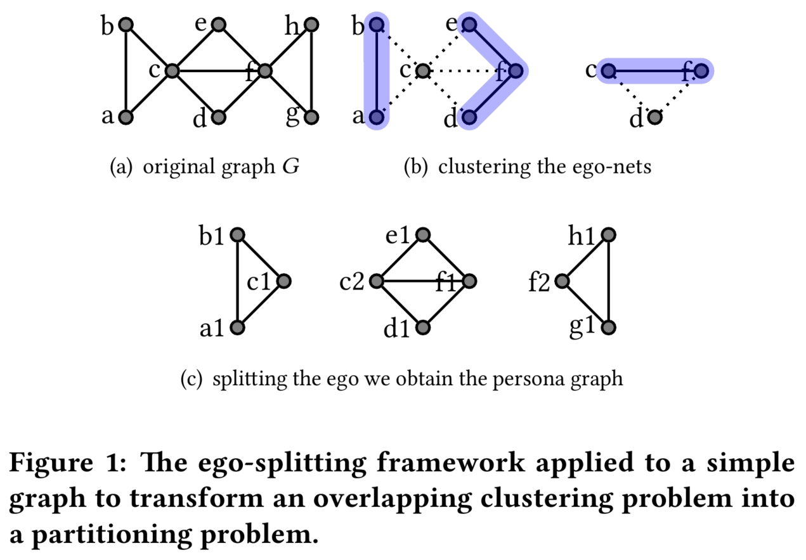

Ego-Splitting Framework
============================================
 [](https://codebeat.co/projects/github-com-benedekrozemberczki-egosplitting-master)

A NetworkX implementation of **Ego-splitting Framework: from Non-Overlapping to Overlapping Clusters (KDD 2017).**
<p align="center">
  
</p>
	
### Abstract
<p align="justify">
We propose a new framework called Ego-Splitting for detecting clusters in complex networks which leverage the local structures known as ego-nets (i.e. the subgraph induced by the neighborhood of each node) to de-couple overlapping clusters. Ego-Splitting is a highly scalable and flexible framework, with provable theoretical guarantees, that reduces the complex overlapping clustering problem to a simpler and more amenable non-overlapping (partitioning) problem. We can solve community detection in graphs with tens of billions of edges and outperform previous solutions based on ego-nets analysis.</p>
<p align="justify">
More precisely, our framework works in two steps: a local ego-net analysis phase, and a global graph partitioning phase . In the local step, we first partition the nodes’ ego-nets using a partitioning algorithm. We then use the computed clusters to split each node into its persona nodes that represent the instantiations of the node in its communities. Then, in the global step, we partition the newly created graph to obtain an overlapping clustering of the original graph.</p>

This repository provides a lightweight NetworkX implementation of Ego-splitting as described in the paper:

> Ego-splitting Framework: from Non-Overlapping to Overlapping Clusters.
> Alessandro Epasto, Silvio Lattanzi, and Renato Paes Leme.
> KDD, 2017.
> [[Paper]](https://www.eecs.yorku.ca/course_archive/2017-18/F/6412/reading/kdd17p145.pdf)

A reference implementation is available [[here]](https://github.com/google-research/google-research/tree/master/graph_embedding/persona).

### Requirements
The codebase is implemented in Python 3.5.2. package versions used for development are just below.
```
networkx          2.4
tqdm              4.28.1
pandas            0.23.4
texttable         1.5.0
argparse          1.1.0
python-louvain    0.13.0
```
### Datasets
<p align="justify">
The code takes the **edge list** of the graph in a csv file. Every row indicates an edge between two nodes separated by a comma. The first row is a header. Nodes should be indexed starting with 0. Sample graphs for `Facebook Politicians` and `Facebook TV Shows` are included in the  `input/` directory.</p>

### Options
Training an Ego-splitter model is handled by the `src/main.py` script which provides the following command line arguments.

#### Input and output options
```
  --edge-path       STR     Edge list csv.            Default is `input/tvshow_edges.csv`.
  --features-path   STR     Membership json.          Default is `output/tvshow_cluster_memberships.json`.
  --resolution      FLOAT   Validation set size.      Default is 1.0.
```
### Examples
The following commands create an egonet splitted overlapping community assignment. (Training a model on the default dataset.)
```
python src/main.py
```
Training a model with a higher resolution.
```
python src/main.py --resolution 2.5
```
Training a model with a lower resolution.
```
python src/main.py --resolution 0.5
```
Training a model on the Facebook TV shows dataset.
```
python src/main.py --edge-path input/tvshow_edges.csv --output-path output/tvshow_cluster_memberships.json
```
